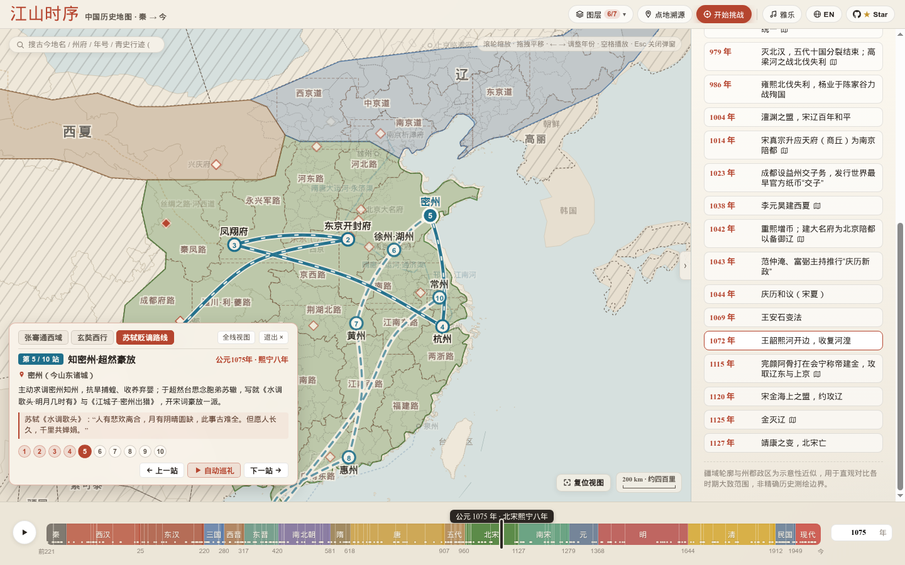
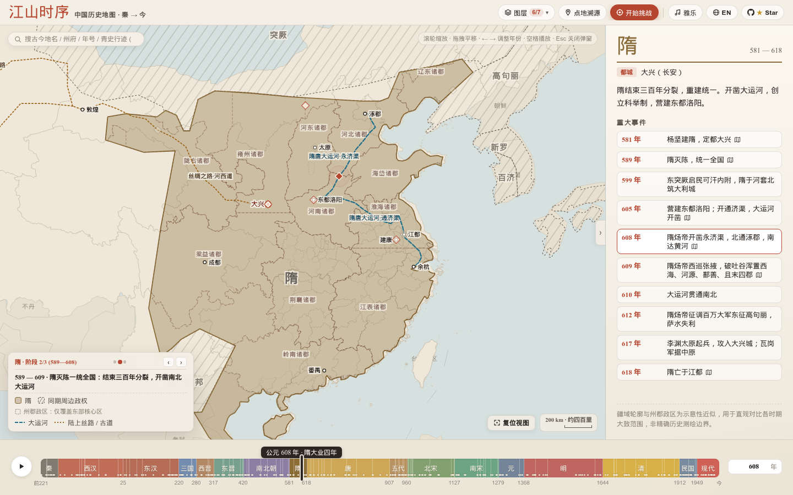
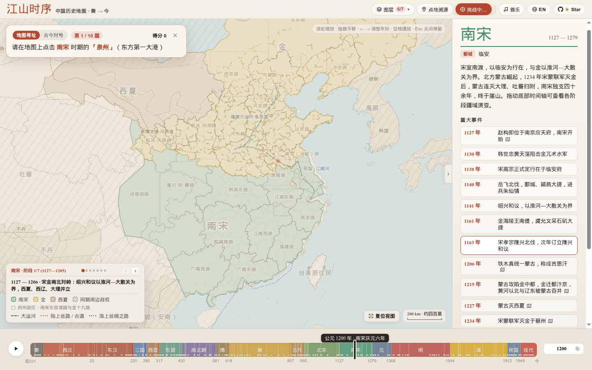

# 江山时序 · Chronicles of the Realm

**一幅可以拖动时间、点城读史、追随古人足迹的中国历史交互舆图（公元前 221 年 — 今）**  
**An Interactive Historical Atlas of China from the Qin Unification (221 BCE) to the Present**

[**立即在线把玩 / Play Live Demo → https://deanchensj.github.io/jiangshan-map/**](https://deanchensj.github.io/jiangshan-map/)

---

## 这幅地图好玩在哪里？ / Why It's Fun to Explore

读史书、背古诗词时，你是否也常有这样的困惑：
- *「六朝古都建康、苏东坡被贬的黄州、岳飞北伐的朱仙镇，放在今天的地图上到底在哪儿？」*
- *「长安在两千年里换过多少个名字？这片土地上先后发生过多少场改写国运的大事？」*
- *「汉武帝打通河西走廊、唐朝极盛期的安西都护府、宋辽夏三足鼎立，版图是怎么一步步演变的？」*

**「江山时序」** 把两千多年的王朝疆域、州郡变迁、历史风云与人物行迹装进了一张宣纸设色古舆图里。你不需要翻检厚重的历史地图册，只需拖动滑块、点点城池，就能在时空之间自由穿梭。

---

### 玩法一：点开任意一座城，读它两千年的身世与风云

在地图上**直接点击任意古城**（或者双击地图任意位置），就会展开一张 **「点地溯源」** 卡片：
- **看古今政区怎么变**：从秦朝的郡、汉朝的刺史部、唐朝的道、宋朝的路，一路看到明清的府省，哪几个朝代曾在此建都（`王朝都城` 徽章）一目了然。
- **看这里发生过什么大事**：每个朝代行下方直接内嵌当年发生在此地的历史大事（如长安的「玄武门之变」「开元盛世」「安史之乱陷长安」）。点一下右上角的 **「史事纪要」** 胶囊，还能一键筛出有大事发生的朝代；点击任意一条事件，时间轴和地图版图立即穿越回那一年！

> [点击直达：盛唐开元二十九年（741 年）· 点开长安看 33 桩千年风云 →](https://deanchensj.github.io/jiangshan-map/?year=741&trace=108.94,34.26)


---

### 玩法二：跟着张骞、玄奘、苏东坡走一趟万里人生路

打开 **「青史行迹」**，你可以化身历史同路人，沿着三条跨越万里与数十载的经典路线逐站巡礼：
- **张骞凿空西域（前 138 — 前 126 年）**：从长安出发，被匈奴羁留十余载不改其志，持汉节一路走到大宛、康居、大月氏。
- **玄奘西行求法（627 — 645 年）**：孤身出玉门关，涉莫贺延碛、越凌山雪隘、渡印度河，抵那烂陀寺求法归唐。
- **苏轼宦海贬谪行迹（1056 — 1101 年）**：从出川赴京、密州超然台赏月，到乌台诗案后贬谪黄州写下《赤壁赋》，再到惠州、跨海远谪海南儋州。

每点「下一站」（或按空格键开启自动巡礼），**底下的历史年份、帝王年号、王朝版图都会跟着古人的脚步同步流转**，卡片里还会浮现他们当年在此地留下的《史记》记载或千古名篇。

> [点击直达：跟着苏东坡去密州与黄州（1075 — 1082 年）→](https://deanchensj.github.io/jiangshan-map/?journey=sushi&stop=4)



---

### 玩法三：拉动时间轴看天下分合，悬停州府查古今对号

- **同屏看多政权对峙**：不仅有中原王朝，匈奴、突厥、吐蕃、回鹘，以及北宋时期的辽、西夏、大理，南宋时期的金、蒙古，都以各自鲜明的设色同屏呈现。鼠标移到左下角图例的政权名字上，对应政权立刻高亮；点一下直接聚焦过去。
- **疆域盈亏「虚线残影」**：同一个朝代内部也有多次疆域伸缩（比如北宋 10 个阶段、唐朝 12 个阶段）。点左下角图例的阶段小圆点或 `‹ / ›` 按钮，图面会浮现上一阶段的朱砂虚线残影，哪块地是新开辟的、哪块地丢了，一眼看穿。
- **300+ 历史州府悬停即查**：放大地图，鼠标指到任意州郡（如北宋的「黄州」、三国的「荆州」），自动高亮州界，并告诉你它属于哪个政权、对应今天的哪个省。

> [点击直达：北宋元丰六年（1083 年）· 宋辽夏三足鼎立与「黄州」州境探查 →](https://deanchensj.github.io/jiangshan-map/?year=1083&zoom=1.85&center=113.5,31.2&hover=%E9%BB%84%E5%B7%9E)


---

### 玩法四：看千年工程动脉、量古代华里、听古琴雅乐

- **长城、运河与丝路随年代生长**：切到秦汉明看万里长城演进，切到隋大业四年（608 年）看隋炀帝开凿的永济渠、通济渠、邗沟、江南河如何把涿郡（今北京）、洛阳、江都（今扬州）与余杭（今杭州）连成一体，切到永乐年间看郑和船队下西洋。
- **读史专用的「公里 / 华里」双标比例尺**：右下角比例尺会随着缩放自动换算公里与传统华里（如 `200 km · 约四百里`），读史书看到「孤军深入三百里」时，直接在图上就能比划出有多远。
- **古琴「雅乐」伴读**：点一下顶部工具栏的 **「雅乐」**，伴着《流水》《平沙落雁》《阳关三叠》《醉渔唱晚》《酒狂》的古琴声慢慢看图，历史氛围直接拉满。

> [点击直达：隋大业四年（608 年）· 隋唐大运河贯通南北 →](https://deanchensj.github.io/jiangshan-map/?year=608)



---

### 玩法五：古地名挑战 —— 测测你在古代能当几品官？

觉得自己历史地理很熟？点右上角的 **「开始挑战」** 试试身手：
- **地图寻址模式**：地图隐去所有文字标注，题目给出「南宋时期的泉州」「六朝古都建康」或「元代的奉元路」，凭你的历史直觉在地图上扎针，系统按你的落点与真实古城的球面距离打分！
- **古今对号模式**：高亮地图上的某座古城，从四个现代城市里选出它的今日真身。
- 十道题答完，系统会根据总分授予你 **「太史令 · 舆图大家」「职方郎中」「州郡从事」** 等传统官阶封号。

> [点击直达：开启「古地名挑战 · 地图寻址」模式 →](https://deanchensj.github.io/jiangshan-map/?year=741&quiz=locate)



---

## 实用快捷键与任意门（Deep Links）

### 快捷键一览

| 操作 / 按键 | 作用 |
| :--- | :--- |
| **`/`** 或 **`Cmd/Ctrl + K`** | 唤醒左上角**万能搜索框**：搜古今地名（`长安`/`西安`）、州府（`黄州`）、年号（`贞观`/`元丰六年`）、年份（`1083`）、事件（`淝水之战`）或人物行迹（`苏轼`） |
| **`←` / `→`** | 时间轴向前 / 向后走 `10` 年（按住 `Shift` 走 `50` 年；行迹模式下切换上一站 / 下一站） |
| **`Space`（空格键）** | 自动播放 / 暂停历史演进（行迹模式下自动巡礼） |
| **`单击古城` / `双击地图`** | 打开该地从秦到清的 15 朝「点地溯源 + 史事纪要」卡片 |
| **`悬停 / 点击图例色块`** | 悬停单独高亮该政权疆域；点击自动缩放聚焦至该政权 |

### 一键直达链接（适合分享给朋友）

你可以直接在网址后面加上参数，把某个特定的历史瞬间分享给朋友：
- **看某一年**：[`?year=741`](https://deanchensj.github.io/jiangshan-map/?year=741)（盛唐开元二十九年） / [`?year=-119`](https://deanchensj.github.io/jiangshan-map/?year=-119)（汉武帝漠北之战）
- **看某场大战**：[`?year=383&event=383`](https://deanchensj.github.io/jiangshan-map/?year=383&event=383)（东晋前秦 · 淝水之战）
- **查某座古城的千年故事**：[`?year=741&trace=108.94,34.26`](https://deanchensj.github.io/jiangshan-map/?year=741&trace=108.94,34.26)（长安/西安） / [`?year=1083&trace=114.35,34.79`](https://deanchensj.github.io/jiangshan-map/?year=1083&trace=114.35,34.79)（东京汴梁/开封）
- **走一段人物行迹**：[`?journey=zhangqian`](https://deanchensj.github.io/jiangshan-map/?journey=zhangqian)（张骞通西域） / [`?journey=xuanzang`](https://deanchensj.github.io/jiangshan-map/?journey=xuanzang)（玄奘西行） / [`?journey=sushi`](https://deanchensj.github.io/jiangshan-map/?journey=sushi)（苏轼贬谪路线）
- **直接开一局挑战**：[`?quiz=locate`](https://deanchensj.github.io/jiangshan-map/?quiz=locate)（地图盲猜寻址） / [`?quiz=match`](https://deanchensj.github.io/jiangshan-map/?quiz=match)（古今地名对号）
- **切换英文版**：[`?lang=en`](https://deanchensj.github.io/jiangshan-map/?lang=en)

---

## English Overview

**Chronicles of the Realm (`jiangshan-map`)** is an interactive historical atlas of China from the Qin unification (221 BCE) to the present day, crafted in the aesthetic of traditional Chinese parchment cartography.

### What You Can Do

1. **Click Any Ancient City to Uncover 2,000 Years of Stories (`Trace Place`)**: Click any city (or double-click anywhere on the map) to see how its name and administrative jurisdiction evolved across 15 dynasties, which empires crowned it as their capital, and every major historical event that unfolded there—click any event to time-travel straight to that year.
2. **Walk in the Footsteps of Historical Figures (`Historical Journeys`)**: Follow **Zhang Qian's** expedition to Central Asia (138–126 BCE), **Xuanzang's** pilgrimage to India (627–645 CE), or **Su Shi's** literary exile across Song China (1056–1101 CE). As you step from stop to stop, the map's reign eras, borders, and primary-source literary quotes evolve in sync.
3. **Scrub Through 2,200+ Years & Inspect 300+ Ancient Prefectures**: Watch empires rise, split, and reunify across 105 territorial stages with dashed **Ghost Boundary Diffs** showing exact frontier shifts. Zoom in and hover over over 300 historical prefectures (*Zhou / Fu / Jun*) to see their modern provincial counterparts.
4. **Explore Historical Megaprojects & Listen to Classical Guqin (`雅乐`)**: Trace the Great Wall, the Grand Canal, the Silk Road, and Zheng He's maritime voyages; measure distances with a live **km / traditional Chinese *li*** dual scale bar; and toggle full-Data English (`EN`) or classical Guqin music in one click.
5. **Play the Ancient Geography Challenge**: Test your historical intuition by pinpointing unlabeled ancient cities on the map (`Map Locate`) or matching ancient names to modern cities (`Name Match`) across 10 rounds to earn traditional imperial court titles.

---

## 本地运行 / Run Locally

项目为纯静态网页，无需安装任何依赖或构建工具，克隆后用任意静态服务器打开即可：  
No dependencies or build steps required. Clone and serve with any static HTTP server:

```bash
git clone https://github.com/DeanChensj/jiangshan-map.git
cd jiangshan-map
python3 -m http.server 8000
```

随后在浏览器打开 `http://localhost:8000`。

---

## 致谢与开源协议 / Credits & License

- **历史疆域与政区参考 / Historical GIS References**: [aourednik/historical-basemaps](https://github.com/aourednik/historical-basemaps) (GPL-3.0), **CHGIS** (Harvard Yenching Institute & Fudan University), and **Robert M. Hartwell** historical GIS datasets.
- **现代省界参考 / Modern Provincial Reference**: DataV GeoAtlas open boundary data.
- **古琴雅乐录音 / Classical Guqin Audio**: Wikimedia Commons public-domain recordings (*Liu Shui*, *Pingsha Luoyan*, *Yangguan Sandie*, *Zuiyu Changwan*, *Jiu Kuang*).
- **说明 / Note**: 地图中的历史疆域轮廓与州郡政区边界为示意性近似，旨在直观呈现各时期大致统治与管辖范围，非精确现代测绘边界。
- **开源协议 / License**: **GPL-3.0**.
