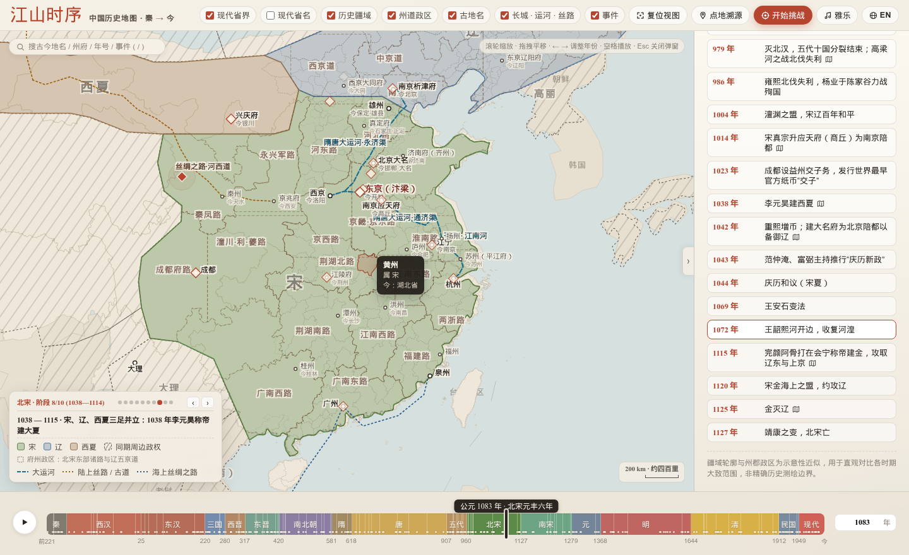
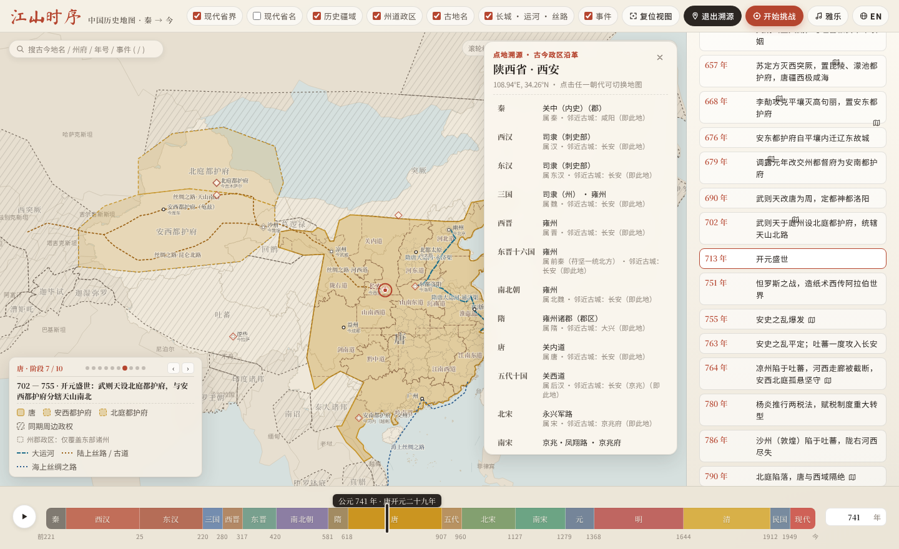

# 江山时序 · Chronicles of the Realm

**中国历史疆域与政区交互式时间轴舆图（公元前 221 年 — 今）**  
**An Interactive Historical Atlas of China from the Qin Unification (221 BCE) to the Present**

[**在线体验 / Live Demo → https://deanchensj.github.io/jiangshan-map/**](https://deanchensj.github.io/jiangshan-map/)

---

## 界面预览 / Interface Preview

### 1. 北宋元丰六年（1083 年）· 二级州府悬停检视（黄州）
> **Northern Song (1083 CE · 6th Year of Yuanfeng) · Prefecture-Level Hover Inspection (`Huangzhou`)**  
> 放大至荆湖北路与江淮之间，鼠标悬停于「黄州」（苏轼谪居黄州作《赤壁赋》次年），图面自动高亮黄州州境多边形并浮窗显示所属政权（宋）及今日对应省份（湖北省）；左下角显示北宋 10 个版图阶段进度条（`阶段 8/10 · 1038—1114`），右下角实时换算古今双标比例尺（`200 km · 约四百里`）。  
> *Zoomed into Central China in 1083 CE with the cursor hovering over **Huangzhou** (where Su Shi composed the Ode on the Red Cliffs), highlighting its prefecture boundary, ruling polity (`Song`), modern provincial mapping (`Hubei`), intra-dynasty stage switcher (`Stage 8/10`), and dual-unit scale bar (`200 km · 400 li`).*  
> [点击直达该视图 / Open this exact view →](https://deanchensj.github.io/jiangshan-map/?year=1083&zoom=1.85&center=113.5,31.2&hover=%E9%BB%84%E5%B7%9E)



### 2. 盛唐开元二十九年（741 年）· 开元十五道与长安「点地溯源」
> **High Tang (741 CE · 29th Year of Kaiyuan) · Fifteen Kaiyuan Circuits & Administrative Genealogy (`Chang'an / Xi'an`)**  
> 展示盛唐本纪版图、开元十五道与安西、北庭两大都护府及海陆丝绸之路，并开启「点地溯源」检视长安（今陕西西安）从秦内史、汉司隶、唐关内道、宋永兴军路直至明清的完整政区沿革，当前朝代（唐）自动朱砂高亮并居中同步。  
> *Visualizing the High Tang empire at its territorial zenith alongside the Fifteen Circuits, the Anxi and Beiting Protectorates, and the Silk Road, with the **Trace Place** card open for Chang'an (`Xi'an, Shaanxi`) and live-synced to the active Tang dynasty row.*  
> [点击直达该视图 / Open this exact view →](https://deanchensj.github.io/jiangshan-map/?year=741&trace=108.94,34.26)



---

## 中文介绍

**「江山时序」** 是一套零外部运行时依赖的纯前端交互式中国历史地图集。项目以宣纸设色舆图为视觉基调，涵盖从秦并天下（前 221 年）至今两千余年的疆域消长、帝王年号纪年、一级行政大区（州 / 道 / 路 / 行省 / 布政使司 / 省）、二级郡县州府边界、古今名城沿革、重大历史事件空间锚点以及长城、运河、丝绸之路等交通动脉。

### 核心功能

1. **105 个高精度多阶段历史疆域快照与「疆域残影对比（Ghost Diff）」**
   - 覆盖 **16 个历史时期**：秦、西汉、东汉、三国、西晋、东晋十六国、南北朝、隋、唐、五代十国、北宋（辽 / 西夏）、南宋（金 / 西夏 / 大蒙古国）、元、明、清、民国及现代。
   - **朝代内阶段步进器**：左下角图例内置阶段圆点与 `‹ / ›` 步进按钮，直显当前阶段起止年份（如 `北宋 · 阶段 8/10 (1038—1114)`）。
   - **疆域残影对比（Ghost Diff）**：在同一朝代内切换阶段或悬停阶段圆点时，图面自动以虚线叠加上一阶段或目标阶段的疆域轮廓残影，直观呈现版图扩张与收缩的精确边界；底部时间轴色块内嵌阶段切分刻度线与事件微标。
2. **全量帝王年号纪年系统（前 221 年 — 1949 年）**
   - 覆盖从秦始皇二十六年（前 221 年）、汉武帝建元/元狩、唐贞观/开元、宋熙宁/元丰直至明清与民国的完整帝王年号表。
   - 时间轴滑块气泡、事件浮窗与搜索框同步展示公历与传统年号（如 `公元前119年 · 西汉元狩四年`、`公元1083年 · 北宋元丰六年`）。
3. **全局快速检索框（快捷键 `/` 或 `Cmd/Ctrl + K`）**
   - 左上角悬浮检索框支持跨朝代即时搜索**古今地名**（如「长安」「建康」「临安」）、**州道政区**（如「黄州」「荆湖北路」）、**帝王年号与公历年份**（如「贞观」「元丰六年」「1083」）、**朝代**及**重大历史事件**（如「淝水之战」），选中后自动跳转年代、平滑飞移镜头并展开沿革或事件详情。
4. **双层历史政区体系（大区常驻 + 州府悬停）与图例双向联动**
   - **第一级行政大区**：图面清晰展示汉十三刺史部、唐开元十五道与天宝节度使、宋代诸路、元代行中书省、明代两京十三布政使司、清代省及将军辖区。
   - **第二级州郡府军（300+ 政区）**：保留精细州郡边界，鼠标悬停（或移动端轻点）即可高亮该州府并显示所属政权与今日对应的现代省份。
   - **图例与政权双向联动**：鼠标悬停左下角图例中的任意政权色块，地图对应政权疆域与国号自动高亮、其余政权半透明退后；点击图例色块自动缩放聚焦至该政权版图范围。
5. **分级古今名城、自动避让排版与动态古今比例尺（`km · 华里`）**
   - 默认视图聚焦历代都城、陪都与重镇；放大视图（`Zoom >= 1.75x`）自动浮现各道、路、行省治所及边塞名城，并标注古今地名对照与历史典故。
   - 画布右下角配备随缩放倍率与中心纬度实时重算的**公制 / 传统华里双标比例尺**（如 `500 km · 约一千里`、`200 km · 约四百里`），读史看图时可直接换算古籍中的行军里程。
6. **点地溯源（古今政区沿革追踪 · 实时同步）**
   - 直接**单击任意古城**（或双击地图任意位置 / 开启「点地溯源」模式），即时生成该地点从秦郡、汉州郡、唐道州、宋路府、元行省到明清府省的 15 朝完整政区沿革卡片。
   - 当前所处朝代自动朱砂高亮并居中滚动；在不关闭卡片的情况下拖动时间轴或切换阶段，卡片会实时同步刷新该地在当前年份的政权与州郡归属。
7. **双模式古地名挑战（十题计分授衔）**
   - **地图寻址**：给定某朝代古地名（如「建康」「临安」「奉元路」「天临路」），在隐去地名的历史底图上点击定址，按大圆球面距离（km）计算得分并绘制误差圈。
   - **古今对号**：结合地图落点提示，从四个现代城市选项中选出古地名对应的今日城市。十题结束后根据总分授予「太史令 · 舆图大家」「職方郎中」等传统官制封号。
8. **青史行迹 · 人物时空巡礼（张骞凿空西域 / 玄奘西行求法 / 苏轼宦海贬谪）**
   - 内置三条横跨万里与数十载的人物叙事路线：**张骞凿空西域**（前 138 — 前 126 年，9 站）、**玄奘西行求法**（627 — 645 年，10 站）、**苏轼宦海贬谪行迹**（1056 — 1101 年，10 站）。
   - 支持从顶部「图层」菜单、全局搜索框 `/`、编年史事件卡「展阅行迹」按钮或 URL 参数开启；支持逐站步进、`Space` 自动巡礼与「全线视图」鸟瞰，切换站点时时间轴年份、帝王年号与底层王朝疆域自动实时联动，配以《史记》《大唐西域记》及东坡诗词原文引文。
9. **历史工程走廊、传统古琴雅乐与全屏舆图模式**
   - 动态按年代渲染秦汉明三代**长城**、隋唐与元明清**大运河**、**陆上丝绸之路**、**唐蕃古道**、**西南丝路（茶马古道）**及**郑和下西洋航线**。
   - 顶部内置 **「雅乐」** 播放器，收录《流水》《平沙落雁》《阳关三叠》《醉渔唱晚》《酒狂》五首公有领域传统古琴名曲，支持曲目切换与 Web Audio 五声音阶离线泛音合成兜底。
   - 支持一键折叠右侧编年栏进入 **100% 全屏舆图模式**，并提供中英双语（`中文` / `EN`）全量无损切换。

### 快捷键与交互速查表

| 操作 / 按键 | 功能说明 |
| :--- | :--- |
| `/` 或 `Cmd/Ctrl + K` | 聚焦左上角全局检索框（搜古今地名 / 州府 / 年号 / 公历年份 / 朝代 / 青史行迹） |
| `←` / `→` | 年份向前 / 向后步进 `10` 年（按住 `Shift + ←/→` 步进 `50` 年；行迹模式下切换上/下一站） |
| `Space`（空格键） | 启动 / 暂停历史时间轴自动演进播放（行迹模式下启动 / 暂停自动巡礼） |
| `Home` / `End` | 一键跳至时间轴起点（前 221 年秦一统）或终点（现代） |
| `Esc` | 关闭当前打开的行迹巡礼、事件气泡、搜索下拉框或点地溯源卡片 |
| **单击古城 / 双击地图** | 直接打开该坐标从秦至清的 15 朝「点地溯源」沿革卡片 |
| **悬停 / 点击左下角图例政权** | 悬停单独高亮该政权版图；点击自动平滑缩放聚焦至该政权疆域 |
| **悬停左下角阶段圆点或 `‹ / ›`** | 在图面实时预览目标版图阶段的朱砂虚线疆域边界（Ghost Diff） |

### 朝代与政区覆盖概览

| 时期 | 年代范围 | 快照数 | 一级政区层级 | 代表性阶段示例 |
| :--- | :--- | :---: | :--- | :--- |
| **秦** | 前221 — 前202 | 3 | 关中与诸郡大区 | 秦并六国、北击匈奴南征百越、秦末楚汉之际 |
| **西汉** | 前202 — 公元25 | 8 | 十三刺史部（州） | 汉初郡国并行、汉武帝开疆、西域都护府设立、新莽时期 |
| **东汉** | 25 — 220 | 6 | 十三州刺史部 | 光武中兴、班超经营西域、黄巾起义与州牧割据 |
| **三国** | 220 — 280 | 6 | 魏蜀吴三方州域 | 魏蜀吴鼎立、诸葛亮北伐、邓艾灭蜀 |
| **西晋** | 280 — 317 | 4 | 十九州 | 太康之治天下一统、八王之乱、永嘉之乱 |
| **东晋十六国** | 317 — 420 | 9 | 侨州与南北州域 | 祖逖北伐、前秦统一北方、淝水之战、刘裕北伐 |
| **南北朝** | 420 — 589 | 9 | 南北诸州 | 元嘉北伐、北魏孝文帝汉化、东西魏与北齐北周对峙 |
| **隋** | 589 — 618 | 4 | 州 / 郡 | 开皇平陈一统、大运河开通与炀帝西巡、隋末群雄 |
| **唐** | 618 — 907 | 12 | 贞观十道 / 开元十五道 / 节度使 | 贞观平突厥、龙朔极盛、开元盛世、安史之乱、元和中兴、河西归义军 |
| **五代十国** | 907 — 960 | 6 | 中原与十国大区 | 后梁后唐争霸、契丹南下燕云、周世宗柴荣北伐 |
| **北宋** | 960 — 1127 | 7 | 十五路 / 二十三路 | 北宋平定江南、澶渊之盟、宋夏庆历和议、联金灭辽与靖康之变 |
| **南宋** | 1127 — 1279 | 8 | 两浙、江南、荆湖、川峡等路 | 岳飞北伐、绍兴和议、蒙古灭金、钓鱼城之战、崖山海战 |
| **元** | 1279 — 1368 | 5 | 中书省、十行省与宣政院辖地 | 元平江南一统、四大汗国格局、元末红巾军起义 |
| **明** | 1368 — 1644 | 7 | 两京十三布政使司与九边重镇 | 洪武开国、永乐迁都与奴儿干都司、土木堡之变、万历三大征 |
| **清** | 1644 — 1912 | 9 | 十八省、东三省与边疆将军辖区 | 康熙平三藩收台湾、乾隆平定准部回部极盛、晚清条约与建省 |
| **民国 / 现代** | 1912 — 今 | 2 | 省 / 自治区 / 直辖市 / 特别行政区 | 民国行政区划、现代省级行政区划对照 |

### URL 参数直达（Deep Linking）

支持通过 URL 参数直接分享或打开特定历史时刻与功能模式：

- 指定年份：`?year=741`（唐开元二十九年）或 `?year=-119`（汉武帝漠北之战）
- 指定年份并弹出事件卡片：`?year=383&event=383`（淝水之战）
- 指定视野并高亮特定二级州府：`?year=1083&zoom=1.85&center=113.5,31.2&hover=黄州`（北宋黄州）
- 直接开启「青史行迹」人物路线：`?journey=zhangqian`（张骞通西域）、`?journey=xuanzang`（玄奘西行）、`?journey=sushi`（苏轼贬谪路线，可加 `&stop=6` 直达黄州站）
- 直接开启某坐标「点地溯源」：`?trace=108.94,34.26`（长安/西安历代沿革）
- 直接开启挑战模式：`?quiz=locate`（地图寻址）或 `?quiz=match`（古今对号）
- 默认英文界面：`?lang=en`

---

## English Introduction

**Chronicles of the Realm (`jiangshan-map`)** is a zero-dependency, pure front-end interactive historical atlas of China. Styled after traditional Chinese parchment cartography, it visualizes over two millennia of territorial evolution from the Qin unification (221 BCE) to the present day, complete with imperial reign eras (*Nianhao*), two-tier administrative divisions, ancient-to-modern city mappings, spatial event markers, curated historical journeys, engineering corridors, and classical Guqin music.

### Key Features

1. **105 Multi-Stage Territorial Snapshots & Ghost Boundary Diff**
   - Covers **16 major historical eras**: Qin, Western Han, Eastern Han, Three Kingdoms, Western Jin, Eastern Jin & Sixteen Kingdoms, Northern & Southern Dynasties, Sui, Tang, Five Dynasties & Ten Kingdoms, Northern Song (with Liao & Western Xia), Southern Song (with Jin, Western Xia & Mongol Empire), Yuan, Ming, Qing, Republic of China, and Present.
   - **Intra-Dynasty Stage Switcher & Ghost Diff**: Step through fine-grained territorial stages within a dynasty using the legend stage bar (`Stage 8/10 · 1038—1114`). Switching or hovering over stages renders a dashed **Ghost Diff** outline of the previous/previewed stage's frontier so territorial expansions and contractions are immediately visible.
2. **Imperial Reign Era (`Nianhao`) Chronology (221 BCE – 1949 CE)**
   - Maps every historical year to its exact traditional Chinese imperial reign era (e.g., *4th Year of Yuanshou* in 119 BCE, *29th Year of Kaiyuan* in 741 CE, *6th Year of Yuanfeng* in 1083 CE) across the timeline scrubber, event balloons, and quick search.
3. **Global Quick Search (`/` or `Cmd/Ctrl + K`)**
   - Instant cross-dynasty search for **ancient & modern city names**, **prefectures & circuits**, **imperial reign eras & Gregorian years**, **dynasties**, **historical milestones**, and **curated historical journeys**, automatically jumping to the target year and flying the camera to the location.
4. **Two-Tier Administrative Hierarchy & Interactive Polity Legend**
   - **First-Level Macro Regions**: Displays Han's 13 Inspectoral Regions (*Zhou*), Tang's 15 Circuits (*Dao*) and Jiedushi defense commands, Song's Circuits (*Lu*), Yuan's Branch Secretariats (*Xingsheng*), and Ming/Qing Provinces (*Sheng*) with automatic label collision avoidance.
   - **Second-Level Prefectures & Commanderies (300+ polygons)**: Preserves detailed prefecture (*Zhou / Fu / Jun*) boundaries derived from CHGIS and Hartwell datasets; hovering highlights the prefecture and reveals its ruling polity and modern provincial equivalent.
   - **Bidirectional Polity Focus**: Hovering any polity swatch in the legend highlights that polity on the map and dims competing realms; clicking the swatch smoothly zooms the camera to frame its territory.
5. **Zoom-Adaptive Historical Cities & Dual-Unit Scale Bar (`km · li`)**
   - Displays imperial capitals and primary metropolises at default zoom, and reveals regional circuit seats and frontier garrisons when zoomed in (`Zoom >= 1.75x`).
   - Features a latitude- and zoom-aware **Dual-Unit Scale Bar** at the bottom-right of the canvas showing both metric kilometers and traditional Chinese *li* (`1 km = 2 li`, e.g., `200 km · 400 li`).
6. **Live-Synced Trace Place (Administrative Genealogy)**
   - Click any ancient city directly (or double-click anywhere on the map) to generate a complete 15-dynasty chronological genealogy from Qin commanderies to Ming/Qing provinces, with the active dynasty highlighted and live-updated as you scrub the timeline.
7. **Dual-Mode Geography Challenge**
   - **Map Locate**: Pinpoint an ancient city on an unlabeled historical map and earn points based on great-circle distance accuracy (km).
   - **Name Match**: Match an ancient city highlighted on the map to its modern counterpart in a 4-way multiple-choice quiz, earning traditional imperial court ranks at the end of 10 rounds.
8. **Curated Historical Journeys (Zhang Qian, Xuanzang, Su Shi)**
   - Interactive stop-by-stop spatiotemporal tours for **Zhang Qian's Mission to the Western Regions** (138–126 BCE, 9 stops), **Xuanzang's Pilgrimage to India** (627–645 CE, 10 stops), and **Su Shi's Literary Exile Across Song China** (1056–1101 CE, 10 stops), synchronized with timeline reign eras, territorial snapshots, and primary-source literary quotes.
9. **Historical Corridors, Classical Guqin Soundtrack (`雅乐`) & Full-Map Mode**
   - Time-filtered rendering of the Great Wall (Qin, Han, Ming), the Grand Canal (Sui–Tang & Yuan–Qing), the overland Silk Road, the Tang–Tibet Ancient Road, the Southwest Tea-Horse Road, and Zheng He's Maritime Voyages.
   - Built-in player featuring five public-domain classical Guqin pieces with a Web Audio pentatonic synthesizer fallback, a one-click collapsible chronicle sidebar for **100% full-map viewing**, and full bilingual (`中文` / `EN`) support.

---

## Local Development / 本地运行

无需安装任何构建工具或打包器，克隆仓库后使用任意静态文件服务器即可运行：  
No build step or bundler required. Clone the repository and serve the root directory with any static HTTP server:

```bash
git clone https://github.com/DeanChensj/jiangshan-map.git
cd jiangshan-map
python3 -m http.server 8000
```

随后在浏览器打开 `http://localhost:8000`。  
Then open `http://localhost:8000` in your browser.

---

## Data Sources & License / 数据来源与开源协议

- **历史政权疆域基图 / Historical Polity Basemaps**: Derived from [aourednik/historical-basemaps](https://github.com/aourednik/historical-basemaps) (GPL-3.0) with custom multi-phase historical refinements.
- **历史州郡与一级政区多边形 / Administrative Polygons**: Derived from **CHGIS** (China Historical Geographic Information System, Harvard Yenching Institute & Fudan University) and **Robert M. Hartwell** historical GIS datasets.
- **现代省界底图 / Modern Provincial Boundaries**: Derived from DataV GeoAtlas / AutoNavi open boundary data for historical-to-modern spatial reference.
- **古琴音频 / Classical Guqin Audio**: Public-domain recordings from Wikimedia Commons (*Liu Shui*, *Pingsha Luoyan*, *Yangguan Sandie*, *Zuiyu Changwan*, *Jiu Kuang*).
- **免责声明 / Disclaimer**: 地图中的历史疆域轮廓与州郡政区边界为示意性历史近似，旨在直观呈现各时期大致统治与管辖范围，非精确现代测绘边界。 / Historical boundaries are schematic approximations intended for educational and comparative visualization.
- **开源协议 / License**: Released under **GPL-3.0**.
